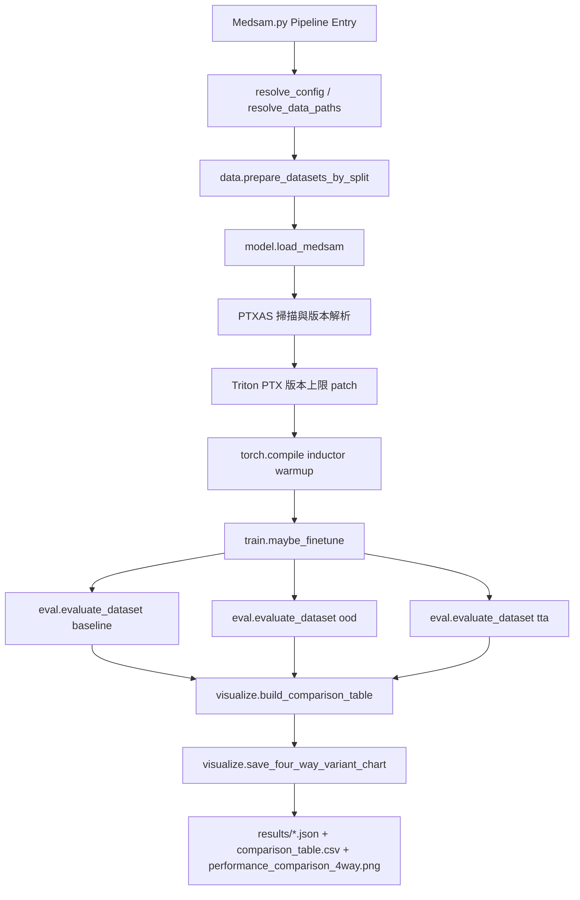

# MedSAM Modular Architecture

本文件說明目前模組化後的執行流程、各模組職責，以及 CUDA 13.2 / PTXAS 自動修復策略。

## 流程圖

## 各模組職責

### Medsam.py
- 入口與 pipeline 編排。
- 負責讀取環境變數設定、建立資料與模型、串接 fine-tune 與評估流程。
- 不放模型細節實作，保持主流程清楚。

### medsam_modular/data.py
- 資料集與 split 載入。
- 實作 TN3K、DDTI、TN5000 三種 Dataset。
- 提供 `prepare_datasets_by_split` 統一產生 train/val/test 資料集合。

### medsam_modular/model.py
- 模型載入、推論輸入轉換、mask 預測。
- 實作 compile/PTXAS 自動修復：
  - 掃描可用 `ptxas`
  - 解析 CUDA release
  - 依版本設定 PTX 目標上限
  - Patch Triton 的 PTX 版本決策
  - 執行 `torch.compile(backend=inductor)` warmup
- 支援 CUDA 13.2 目標：
  - `ptxas >= 13.2` 時，目標 PTX 設為 `9.2`。
  - 可用 `MEDSAM_STRICT_PTXAS_13_2=1` 強制要求 13.2。

### medsam_modular/train.py
- 完整 fine-tune 迴圈（非 placeholder）：
  - train/val 載入與 fallback 切分
  - AMP、Gradient Accumulation、Gradient Clipping
  - AdamW（可選 fused）
  - Early Stopping（patience/min_delta）
  - best/last checkpoint 保存
  - best 權重回載

### medsam_modular/eval/
- OODDetector、TTAPredictor、metrics、autobatch 與 dataset evaluation 入口。
- `evaluate.py` 保留目前主要實作，`metrics.py`、`ood.py`、`tta.py`、`autobatch.py`、`evaluate_api.py` 提供分層匯入入口。

### medsam_modular/pipeline/
- Stage 3/4/6/7/8 的 pipeline entry points。
- `runner.py` 負責總 orchestration，stage 模組提供後續搬移實作的穩定邊界。

### medsam_modular/cache.py
- 推論結果快取。
- 以資料集+樣本+bbox+模式建立 key，降低重複推論成本。

### medsam_modular/visualize.py
- 建立比較表與輸出圖表。
- 統一產生 `comparison_table.csv` 與 `performance_comparison_4way.png`。

## 重要環境變數

### Compile / PTXAS
- `MEDSAM_ENABLE_COMPILE`：是否啟用 `torch.compile`。
- `MEDSAM_COMPILE_MODE`：compile mode（預設 `max-autotune`）。
- `MEDSAM_STRICT_PTXAS_13_2`：設為 `1` 時強制要求 `ptxas >= 13.2`。

### Fine-tune
- `MEDSAM_SKIP_FINETUNE`
- `MEDSAM_FINETUNE_EPOCHS`
- `MEDSAM_FINETUNE_BATCH`
- `MEDSAM_FINETUNE_LR`
- `MEDSAM_FINETUNE_VAL_RATIO`
- `MEDSAM_FINETUNE_PATIENCE`
- `MEDSAM_FINETUNE_MIN_DELTA`
- `MEDSAM_FINETUNE_GRAD_ACCUM`
- `MEDSAM_FINETUNE_GRAD_CLIP`
- `MEDSAM_FINETUNE_MAX_SAMPLES`
- `MEDSAM_FINETUNE_WORKERS`
- `MEDSAM_FINETUNE_TRAIN_BACKBONE`
- `MEDSAM_FINETUNE_USE_FUSED_ADAMW`
